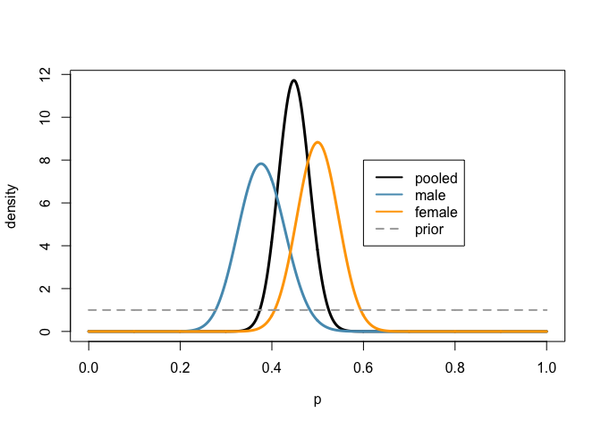

Comparing two proportions using Bayes factors
================
Dr. Merlise Clyde, Duke University

create the data based on summary counts
---------------------------------------

``` r
USASurvey = matrix(c(34,61,52,61, 4,0), ncol=2,byrow=T)
colnames(USASurvey) = c("Male", "Female")
rownames(USASurvey) = c("Yes", "No", "Not Sure")
```

### compute the sample sizes in each group

``` r
n = apply(USASurvey, 2, sum)
```

Recall: we are combining "No" and "Not Sure" into the "Not Yes" group, so for analyses we need just the total counts in each group `n` and the number of "Yes" counts or the first row `USASurvey[1,]`.

plot of prior and posterior distributions
-----------------------------------------

``` r
aA.M = c(.5, .5)   # default beta hyperparameters for Males
aA.F = c(.5, .5)   # default beta hyperparameters for Females
aO = aA.M + aA.F   # Combined Prior
x = seq(0, 1, length=1000)

plot(x, dbeta(x, USASurvey[1,"Male"]+ USASurvey[1,"Female"] + aO[1], 
              n[1]+n[2] - (USASurvey[1,"Male"]+USASurvey[1,"Female"]) +  
              aO[2]), 
     type="l", col="black", lwd=3, 
     xlab=expression(p), ylab="density")
# add posterior for male under HA
lines(x, dbeta(x, USASurvey[1,"Male"] + aA.M[1], 
               n[1]-USASurvey[1,"Male"] + aA.M[2]), type="l", col=myblue,
     lwd=3)
# add prior for female under HA
lines(x, dbeta(x, USASurvey[1,"Female"] + aA.F[1],  
               n[2] - USASurvey[1,"Female"] + aA.F[2]), 
      col="orange", lwd=3)
# add pooled prior
lines(x, dbeta(x, aO[1], aO[2]), lty=2, col="darkgrey", lwd=2)
# legend
legend(.6, 8, legend=c("pooled","male", "female", "prior"), 
       col=c("black", myblue, "orange", "darkgrey"),
       lwd=rep(2,4),  lty=c(rep(1,3),2)
        )
```



compute the Bayes factor and posterior probabilities
----------------------------------------------------

We can directly calculate the Bayes factor from the slides using the `beta` function in `R`. However, because of the number of expressions and the fact that we may want to re-use this code, let's define a function and use it. This is provided primarily for the energetic learner that would like to dive deeper, so feel free to skip over this and just use the provided function as described in the next section.

``` r
bayes.prop.test = function(yA, nA, yB, nB, pH0 = .5, alphaA=.5, betaA=NULL,alphaB=.5, betaB=NULL,
                           alphaC=NULL, betaC=NULL) {
  if (is.null(betaA)) betaA = alphaA
  if (is.null(betaB)) betaB = alphaB
  if (is.null(alphaC)) alphaC = alphaA + alphaB
  if (is.null(betaC))  betaC =  betaA + betaB
  logmarg0 = lbeta(yA + yB + alphaC, nA + nB - yA - yB + betaC) -
             lbeta(alphaC, betaC)
  logmarg1 = lbeta(yA + alphaA, nA - yA + betaA) + 
             lbeta(yB + alphaB, nB - yB + betaB) -
             lbeta(alphaA, betaA) - lbeta(alphaB, betaB)
  BF0.1 = exp(logmarg0 - logmarg1)
  prior.oddsH1 = (1 - pH0)/pH0
  postprobH0 = 1/(1 + prior.oddsH1/BF0.1)

  return(list(postprobH0 = postprobH0, BF.H02H1 =  BF0.1))
}
```

This takes as input the number of successes and sample sizes in the two groups, the prior probability of H0 which by default is set to `ph0= .5`, and the prior hyperparameters. By default these are based on the Jeffreys’ prior within each group, but you may supply other values to explore sensitivity or supply more informative values. By default the hyperparameters of the beta distribution under HO are based on pooling the two groups.

The `lbeta` function is used to compute the log beta function. This is more stable numerically and the terms are added on the log scale to obtain the log of the marginal likelihood. Exponentiation the difference in the log marginal likelihoods provides the desired Bayes factor.

This function returns the following values \* `postprobH0` the posterior probability of HO \* `BF.H02H1` the Bayes factor for comparing HO to HA. This can be used with other prior odds to determine alternate posterior probabilities.

### evaluate the Bayes factor and posterior probability

Let's see what the function provides for the `USASurvey` data. The prior hyperparameters that we specified are the default options, so we just need to provide the number of males, females and sample sizes in the groups.

``` r
out = bayes.prop.test(USASurvey[1,"Male"], n[1], 
                      USASurvey[1,"Female"], n[2])
out
```

    ## $postprobH0
    ## [1] 0.7454055
    ## 
    ## $BF.H02H1
    ## [1] 2.927815

From this we can obtain the posterior probability using `out$postprobH0` and the Bayes factor using `out$BF.H02H1`.

Advanced Topic: Beyond the Video
--------------------------------

Consonni et al (2013) provide generalizations of this default Bayes factor for testing in Binomial data to address tow problems that arise with conventional Bayes factors. The first is that if the prior distribution under the more complex model is too diffuse (what we will see coming up as Bartlett's paradox) then the Bayes factor may inflate evidence for the simpler model. This can also occur in large sample sizes and is know as Lindley's paradox that we will discuss later. The second is that when the simpler model is actually true, the evidence may accumulate slowly in favor of the simple model, even with large sample sizes. Consonni et al consider intrinsic priors (a way of converting a non-informative prior in to a proper distribution) that address the Lindley/Bartlett paradox while combining that with moment based priors or non-local priors that provide faster accumulation of evidence when the simpler model is true, leading to what they refer to as a "balanced objective prior". The priors and Bayes factors are pretty complicated, but we can implement numerically.

Let's load the code and compute the BF for *H*<sub>2</sub> to *H*<sub>1</sub>:

``` r
source("BF-prop.R")
BF10.IM(USASurvey[1,1], USASurvey[1,2], n[1], n[2], b=.5, h=1, t1=4, t2=4)
```

    ## [1] 0.09243302

``` r
1/BF10.IM(USASurvey[1,1], USASurvey[1,2], n[1], n[2], b=.5, h=1, t1=4, t2=4)
```

    ## [1] 10.81864

This provides even stronger evidence in favor of the simpler model that the probabilities are equal and illustrates that Bayes Factors may be quite sensitive to the choice of prior distribution on parameters.

Reference
---------

Consonni, G., Forster, J.J. and La Rocca, L. (2013) The Whetstone and the Alum Block: Balanced Objective Bayesian Comparison of Nested Models for Discrete Data. *Statistical Science* 28: 398-423. DOI: 10.1214/13-STS433 <https://arxiv.org/pdf/1310.0661v1.pdf>
