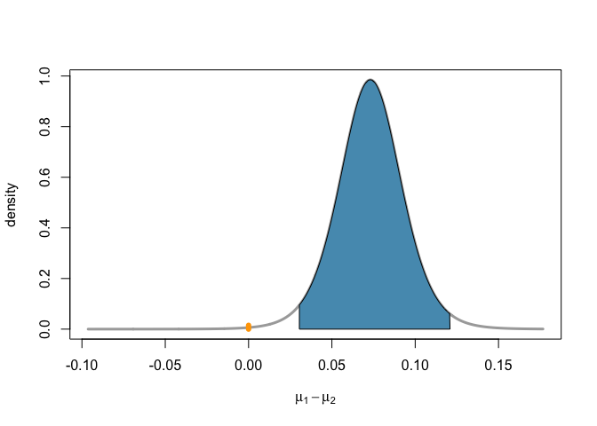

What to report?
================
Dr. Merlise Clyde, Duke University

Read in the data as before and calculate the diffence in zinc concentration

``` r
zinc =  read.table("https://onlinecourses.science.psu.edu/stat500/sites/onlinecourses.science.psu.edu.stat500/files/data/zinc_conc.txt", 
                   header=T, fileEncoding="UTF-16LE")
zinc$difference = zinc$bottom - zinc$surface
```

### posterior probabilities and summaries

Let's add to our `bayes.t.test` function some expressions to calculate the posterior mean under H2 and averaged over H1 and H2, credible intervals, probabilities of one-sided hypotheses, and an optional plot of the posterior distribution. Just skip to the next block to use the function.

``` r
bayes.t.test = function(x, n0=1, mu0 = 0,  prior.H1=.5,nsim=5000, plot=FALSE,...) {
  require(coda)
  out = t.test(x - mu0)
  t = as.numeric(abs(out$statistic))
  n = length(x)
  # BF is BF of H1 to H0
  BF=exp(.5*(log(n + n0) - log(n0) +
                 (n-1)*(log(t^2*n0/(n + n0) + (n - 1)) -
                 log(t^2 + n - 1))))
  PO= BF*prior.H1/(1 - prior.H1)
  post.prob.H1 = 1/(1 + 1/PO)
  post.prob.H2 = 1 - post.prob.H1
  ybar = mean(x)
  
  # posterior mean and scale parameter for t distribiution under H2
  post.mean.H2 = (ybar*n + n0*mu0)/(n + n0)
  scale = sqrt((var(x)*(n-1)  + ybar^2*n*n0/(n + n0))/((n-1)*n))
  
  post.mean.bma = post.prob.H2*post.mean.H2  + post.prob.H1*mu0
  
  #  generate nsim draws of mu[1] - mu[2] under H2 using the t distribution
  # and at 0  under H1
  sim = c(rt(round(nsim*post.prob.H2), df=n-1)*scale + post.mean.H2,  
        rep(0, round(nsim*post.prob.H1)))

  # find the overall creidble interval using a HPD interval
  ci = HPDinterval(as.mcmc(sim))
 
  # make the plot of the posterior distribution
  if (plot) {
  myblue = rgb(86,155,189, name="myblue", max=256)
  x= seq(ybar - out$conf.int[2]*1.5, out$conf.int[2]*1.5, length=1000)

  # rescale distribution
  modeheight = dt(df=n-1, x=0)/scale
  density = ( (1-post.prob.H1)/modeheight)*
            dt(df=n-1, x=(x - post.mean.H2)/scale)/scale
  plot(x, density , type="l", col="darkgray", lwd=3, 
       xlab=expression(mu[1] - mu[2]), 
       ylab="density", ...)
  # add pointmass at 0 with height posterior prob of H1
  segments(0, 0, 0, post.prob.H1, col="orange", lwd=6)

  # fill in 95% HPD region
  cimu = x > ci[1] & x < ci[2]
  polygon(c(ci[1], x[cimu], ci[2]), c(0, density[cimu], 0), col=myblue)
  }
  
  # one sided hypotheses (conditional and unconditional)
  cprob.H3 = 1 - pt(df = n-1, q = (mu0 - post.mean.H2)/scale)
  cprob.H4 = 1 - cprob.H3
  prob.H3 = cprob.H3*post.prob.H2
  prob.H4 = cprob.H4*post.prob.H2
 
return(list(BF.H1.H2=BF, post.prob.H1 = post.prob.H1,
            post.mean.H2 = post.mean.H2, post.mean.bma = post.mean.bma, ci = ci,
            prob.gt.mu0 = prob.H3, prob.lt.mu0 = prob.H4,
            cond.prob.gt.mu0=cprob.H3, cond.prob.lt.mu0=cprob.H4,
            ybar = ybar,t=t, p.value=out$p.value, df=n-1))
}
```

Let's use the function and create the plot of the posterior distribution

``` r
out = bayes.t.test(zinc$difference, plot=T)
```

    ## Loading required package: coda



Typing the name of the function will produce the numerical summaries. Note some of these will be different from the slides due simulation variability.

``` r
out
```

    ## $BF.H1.H2
    ## [1] 0.02634303
    ## 
    ## $post.prob.H1
    ## [1] 0.02566689
    ## 
    ## $post.mean.H2
    ## [1] 0.07309091
    ## 
    ## $post.mean.bma
    ## [1] 0.07121489
    ## 
    ## $ci
    ##           lower    upper
    ## var1 0.02309869 0.122891
    ## attr(,"Probability")
    ## [1] 0.95
    ## 
    ## $prob.gt.mu0
    ## [1] 0.9727534
    ## 
    ## $prob.lt.mu0
    ## [1] 0.001579737
    ## 
    ## $cond.prob.gt.mu0
    ## [1] 0.9983786
    ## 
    ## $cond.prob.lt.mu0
    ## [1] 0.001621352
    ## 
    ## $ybar
    ## [1] 0.0804
    ## 
    ## $t
    ## [1] 4.863813
    ## 
    ## $p.value
    ## [1] 0.0008911155
    ## 
    ## $df
    ## [1] 9
