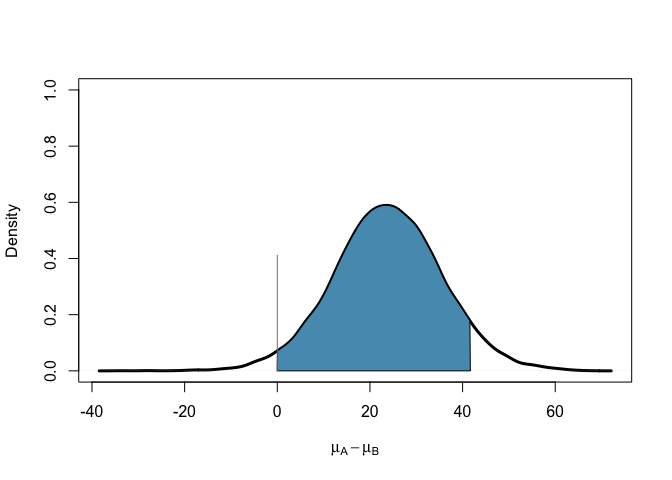
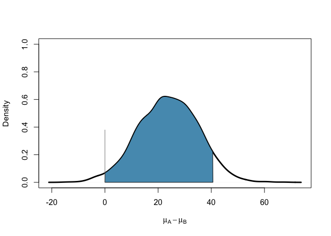

Comparing two independent means
================
Dr Merlise Clyde, Duke University

Define the data using summary statistics

``` r
y = c(52.1, 27.1)
sd=c(45.1, 26.4) 
n=c(22,22)
```

### Initialization

Source functions for slides. There are a number of functions in this file to implement the methods.

``` r
source("behren-fisher.R")
myblue = rgb(86,155,189, name="myblue", max=256)
```

### MCMC Sampling

Run the MCMC sampler using R functions (this does not require `jags`. This uses numerical integration to obtain the marginal likelihoods that enter into the Bayes factors and MCMC sampling to sample from the posterior distributions under H2. Under H1 the difference is exactly 0 so no simulations are needed. The `plot=T` option will produce a plot of the posterior distribution under H2 with the pointmass at 0 under H1 and with a shaded area corresponding to the 95% HPD region combining draws from H1 and H2.

``` r
set.seed(5)
out = BFt.test(y = c(52.1, 27.1), grp=NULL, sd=c(45.1, 26.4), n=c(22,22),
               method="intrinsic",  suff=T,jags=F,nsim=10000,
               colHPD=myblue, main="", 
               xlab=expression(mu[A] - mu[B]), lwd=3, plot=T)
```

    ## Loading required package: cubature

    ## Loading required package: R2WinBUGS

    ## Loading required package: coda

    ## Loading required package: boot



From the output we can extract the overall 95% HPD interval for the difference of the means and the posterior probability of H0 (that the means are equal).

``` r
out$ci
```

    ##            lower    upper
    ## var1 -0.03076586 41.67141
    ## attr(,"Probability")
    ## [1] 0.9499971

``` r
out$post.prob
```

    ## [1] 0.4110297

This is based on simulating from the posterior distribution so the credible interval may change slighly if different random seeds are used or if more simulations are used.

We can also compute the credible interval conditional on H1 from the output.

``` r
HPDinterval(as.mcmc(out$diff[out$diff != 0]))
```

    ##           lower    upper
    ## var1 -0.5209512 45.83315
    ## attr(,"Probability")
    ## [1] 0.95

Remember this is calculated assuming that the means are different and so does not include the "draws" from the posterior under H1 that the means are exactly zero.

The sample mean under H1 is

``` r
mean(out$diff[out$diff != 0])
```

    ## [1] 23.88456

The overall mean based on averaging over the two hypotheses is obtained by taking the mean under H0 times the posterior probabilty of H0 plus the posterior mean under H1 times the posterior probabilty of H1.

``` r
out$post.prob.H0*0 + 
  (1 - out$post.prob.H0)*mean(out$diff[out$diff != 0])
```

    ## [1] 14.0673

### Using JAGS

If you have installed `jags` on your computer, then the following option using `jags=TRUE` is much faster, although the estimates of the posterior probability are subject to Monte Carlo variation. To reduce that you may need to use a larger number of simulations. If you have not installed `jags` comment out the chunk below.

``` r
set.seed(5)
#out = BFt.test(y = c(52.1, 27.1), sd=c(45.1, 26.4), n=c(22,22), 
#               method="intrinsic", colHPD=myblue, nsim=1000000,
#               suff=T, jags=TRUE, main="", 
#               xlab=expression(mu[A] - mu[B]), lwd=3, plot=T)

out.jags = BFt.test(y = y, grp=NULL, sd=sd, n=n,
               method="intrinsic",  suff=T,jags=TRUE, nsim=100000,
               colHPD=myblue, main="", 
               xlab=expression(mu[A] - mu[B]), lwd=3, plot=T)
```

    ## Loading required package: R2jags

    ## Loading required package: rjags

    ## Linked to JAGS 4.2.0

    ## Loaded modules: basemod,bugs

    ## 
    ## Attaching package: 'R2jags'

    ## The following object is masked from 'package:coda':
    ## 
    ##     traceplot

    ## module glm loaded

    ## Compiling model graph
    ##    Resolving undeclared variables
    ##    Allocating nodes
    ## Graph information:
    ##    Observed stochastic nodes: 4
    ##    Unobserved stochastic nodes: 8
    ##    Total graph size: 80
    ## 
    ## Initializing model



Estimates from jags

``` r
out.jags$ci
```

    ##      lower    upper
    ## var1     0 40.61229
    ## attr(,"Probability")
    ## [1] 0.95

``` r
out.jags$post.prob
```

    ## [1] 0.379

These will not agree completely with the estimates above as `jags` does not allow the limiting "improper" prior distributions that are used in the intrinsic prior.

``` r
HPDinterval(as.mcmc(out.jags$diff[out.jags$diff != 0]))
```

    ##         lower   upper
    ## var1 2.014207 44.8992
    ## attr(,"Probability")
    ## [1] 0.9500805
